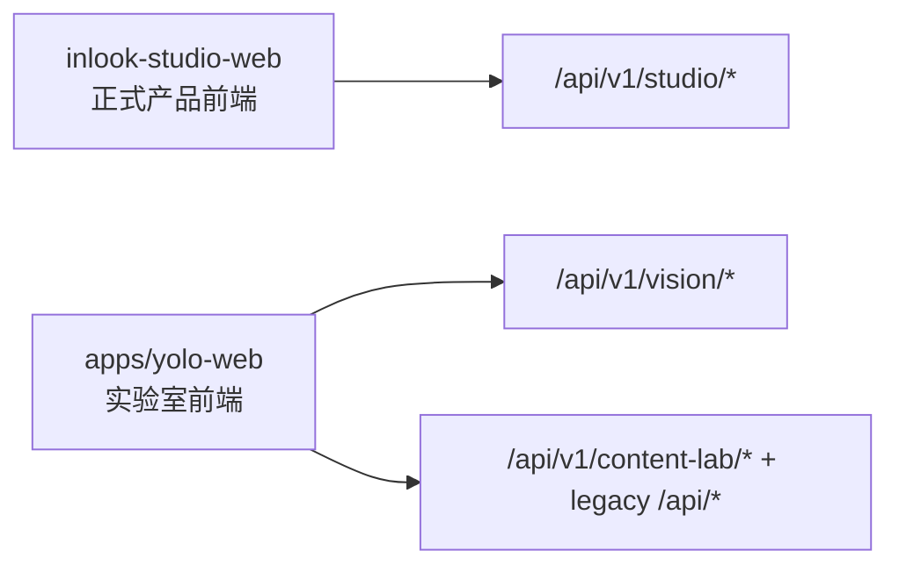
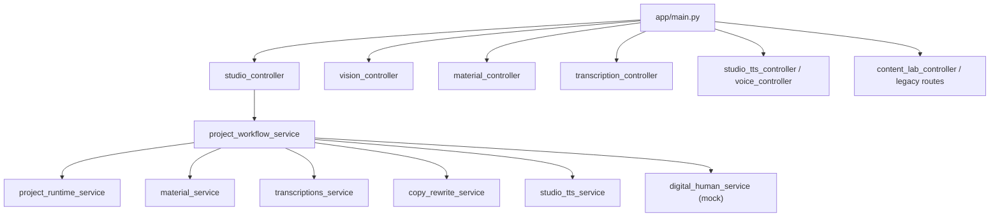
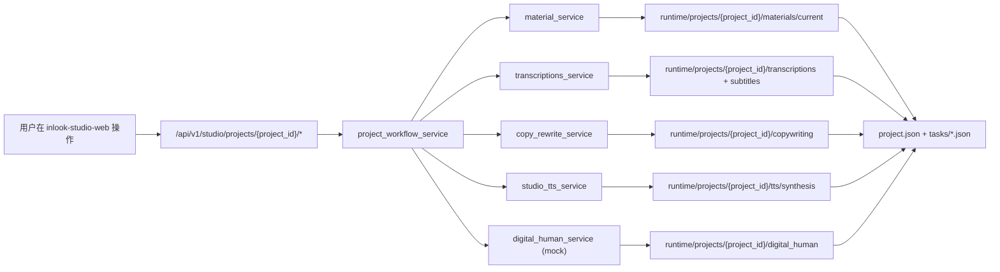
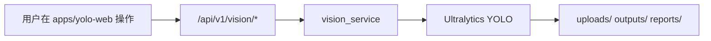

# INLOOK Architecture

更新时间：2026-06-16

## 1. 前端职责

当前仓库前端职责已经收敛为两条明确主线：

- `inlook-studio-web`
  - 正式产品主前端
  - 面向素材导入、文案提取、AI 改写、音色管理、TTS、字幕、导出编排
  - 主流程通过 `/api/v1/studio/*` 串联 project workflow
- `apps/yolo-web`
  - 实验室前端
  - 面向 YOLO 图片/视频/摄像头识别，以及保留的旧 content-lab 试验面板
  - 不再承担正式 Studio 产品主流程



## 2. 后端分层

后端仍然是单一 FastAPI 服务，但对外职责已经分为三层：

- `controllers`
  - 负责 API 路由和兼容入口
- `services`
  - 负责业务编排和主流程
- `clients/providers/tasks`
  - 负责具体执行能力、外部依赖和遗留任务目录适配

其中产品主线新增了一层明确的 project workflow：

- `project_runtime_service`
  - 统一管理 `runtime/projects/{project_id}` 目录和项目级任务快照
- `project_workflow_service`
  - 串联素材导入、转写、AI 改写、TTS、字幕归档、数字人 mock 任务
- `studio_controller`
  - 对外暴露 `/api/v1/studio/*`



## 3. Runtime 目录

正式产品主线统一归档到：

```text
apps/yolo-api/runtime/projects/{project_id}/
├── project.json
├── tasks/
├── materials/
│   └── current/
├── transcriptions/
├── copywriting/
├── tts/
│   └── synthesis/
├── subtitles/
├── render/
└── digital_human/
```

各目录职责如下：

- `project.json`
  - 项目级状态入口
  - 记录当前素材、当前转写、当前改写、当前 TTS、当前数字人任务
- `tasks/`
  - 项目级任务快照
  - 用于主前端任务列表读取
- `materials/current/`
  - 当前项目素材快照
  - 从现有 `content_lab/materials/<material_id>` 复制归档
- `transcriptions/<transcription_id>/`
  - 单次转写结果快照
- `copywriting/`
  - AI 改写结果 JSON
  - 包含 `latest.json`
- `tts/synthesis/<synthesis_id>/`
  - TTS 任务和生成音频快照
- `subtitles/`
  - 当前项目统一字幕出口
- `render/`
  - 后续视频导出与成片输出预留
- `digital_human/`
  - 数字人 mock 任务与未来真实引擎结果预留

保留的历史 runtime：

- `runtime/content_lab/`
  - 现有素材、音色、TTS 等底层能力和历史数据
- `runtime/content_workflow/`
  - 旧 content-lab 工作流
- `runtime/studio_alpha/`
  - 历史 Studio 转写与训练输出

原则：

- 新增正式产品编排统一写入 `runtime/projects/*`
- legacy 路由只做兼容，不新增业务编排逻辑
- 底层能力仍可复用旧目录，但产品主线必须做 project snapshot

## 4. 核心数据流

### 4.1 Studio 主流程



### 4.2 实验室主流程



## 5. API 约束

正式产品主线接口：

- `POST /api/v1/studio/projects`
- `GET /api/v1/studio/projects/{project_id}`
- `GET /api/v1/studio/tasks`
- `POST /api/v1/studio/projects/{project_id}/materials/extract`
- `POST /api/v1/studio/projects/{project_id}/materials/upload`
- `POST /api/v1/studio/projects/{project_id}/transcriptions`
- `POST /api/v1/studio/projects/{project_id}/copy/rewrite`
- `POST /api/v1/studio/projects/{project_id}/tts/synthesis`
- `GET /api/v1/studio/projects/{project_id}/tts/synthesis/{synthesis_id}`
- `POST /api/v1/studio/projects/{project_id}/digital-human/generate`
- `GET /api/v1/studio/projects/{project_id}/files/{file_path}`

兼容原则：

- 保留现有 `legacy /api/*` 和 `content-lab` 路由
- 不在 legacy 路由继续新增主业务逻辑
- 新能力优先挂在 `/api/v1/studio/*`

## 6. 数字人扩展点

当前数字人能力只保留接口合同和 mock 任务，不接 LatentSync，也不接入真实推理引擎。

当前状态：

- `digital_human_service` 返回 mock task
- project runtime 会为数字人任务保留目录和状态快照
- 前端可展示任务创建结果，但不会依赖真实视频输出

未来接入真实数字人的推荐扩展点：

1. 在 `digital_human_service` 内新增 provider 抽象
2. 保持 `project_workflow_service` 只做编排，不直接绑定具体引擎
3. 将真实输出统一归档到 `runtime/projects/{project_id}/digital_human/{task_id}/`
4. 导出链路从 `render/` 目录读取数字人视频作为上游输入

## 7. 当前重构边界

这次收敛重构的目标不是重写全部底层能力，而是建立明确主线：

- 主前端收敛到 `inlook-studio-web`
- 主编排收敛到 `/api/v1/studio/*`
- 主归档收敛到 `runtime/projects/{project_id}`
- legacy 保留兼容，但停止扩展

这让后续再接导出、项目历史、项目恢复、数字人真实引擎时，有稳定的产品骨架可接入。
