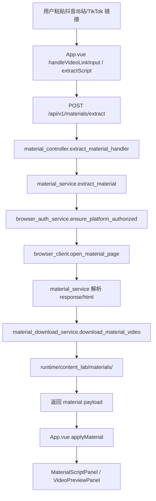
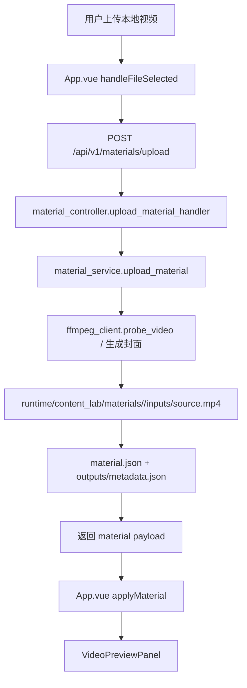
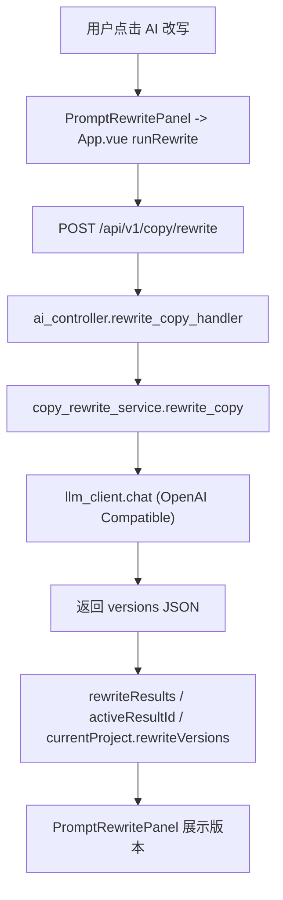
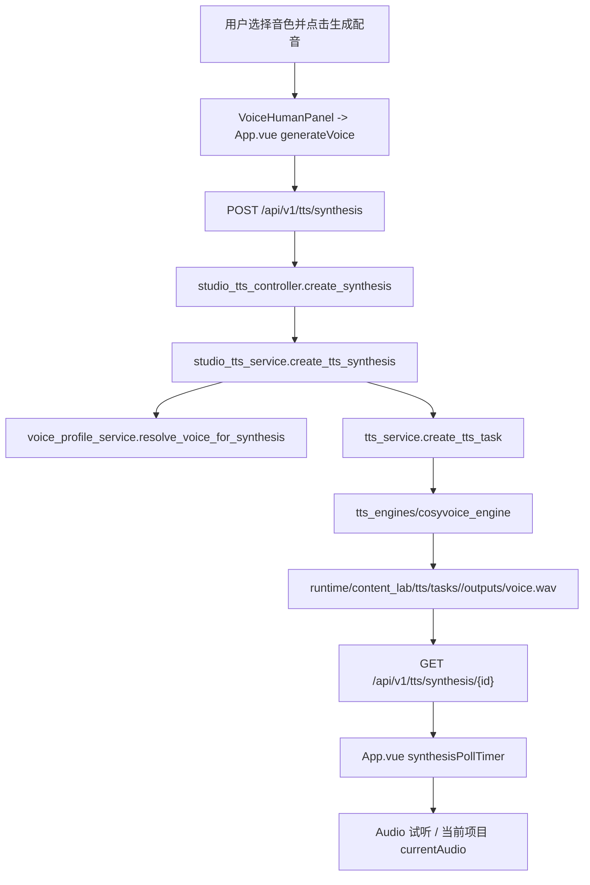
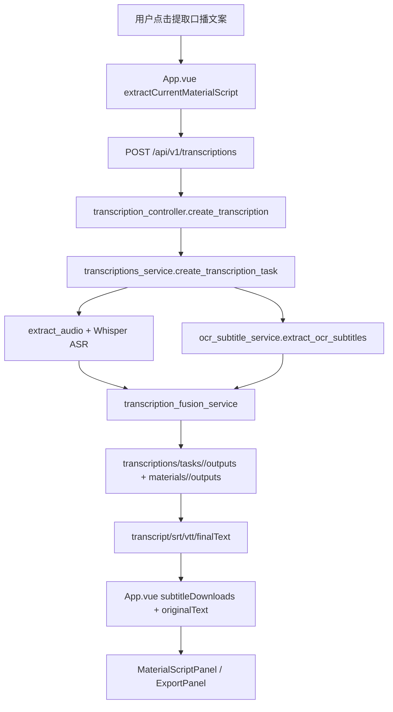

# INLOOK Studio 当前主流程时序图

更新时间：2026-06-12

## 1. 素材链接解析流程



关键文件：

- [App.vue](/Users/shen/workspace/src/github.com/inlook-web3/inlook-yolo-model-lab/inlook-studio-web/src/App.vue)
- [materials.js](/Users/shen/workspace/src/github.com/inlook-web3/inlook-yolo-model-lab/inlook-studio-web/src/api/materials.js)
- [material_controller.py](/Users/shen/workspace/src/github.com/inlook-web3/inlook-yolo-model-lab/apps/yolo-api/app/controllers/material_controller.py)
- [material_service.py](/Users/shen/workspace/src/github.com/inlook-web3/inlook-yolo-model-lab/apps/yolo-api/app/services/material_service.py)
- [browser_client.py](/Users/shen/workspace/src/github.com/inlook-web3/inlook-yolo-model-lab/apps/yolo-api/app/clients/browser_client.py)

## 2. 本地视频上传流程



输出文件：

- `runtime/content_lab/materials/<material_id>/inputs/source.mp4`
- `runtime/content_lab/materials/<material_id>/material.json`
- `runtime/content_lab/materials/<material_id>/outputs/metadata.json`

## 3. 文案改写流程



说明：

- 改写结果当前只保存在前端内存，不写文件。
- 页面刷新后会丢失。

## 4. TTS 生成流程



## 5. 字幕生成流程



## 6. 最终视频导出流程

```text
用户点击导出
-> ExportPanel 显示导出设置
-> render-video 事件已定义
-> App.vue 当前没有接入真实导出处理
-> 按钮被硬编码 disabled
-> 无后端导出接口
-> 无 FFmpeg 最终 MP4 输出
```

结论：

- 这是当前主产品最明确的断链。
- BGM、人声音量、字幕样式、分辨率、保存到素材库等设置都还没有接到真实导出执行层。

## 7. 实验能力说明

- 数字人流程没有进入主产品必经链路。
- 当前 `POST /api/v1/digital-human/generate` 会直接返回“数字人引擎暂未接入”。
- FaceFusion、LongCat 等都在 `runtime/avatar_poc` 范围，不应视为主产品正式工作流。
