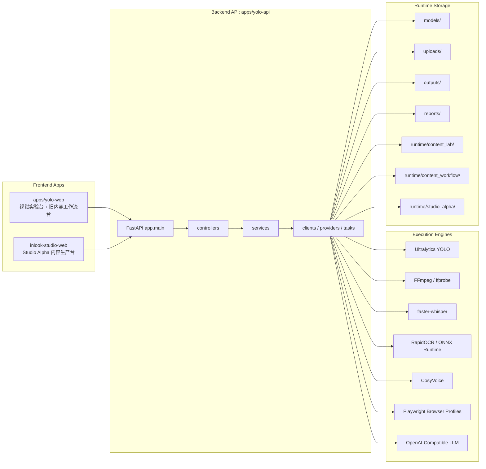
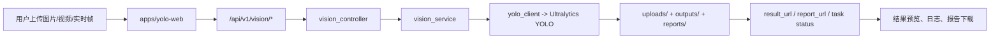
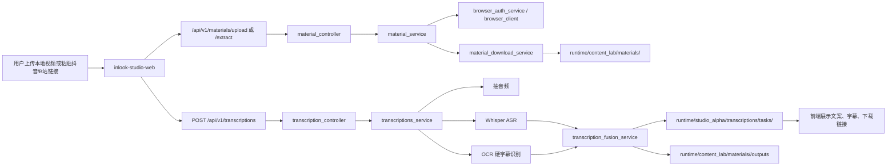
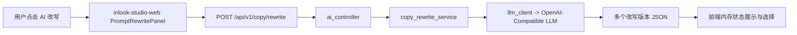
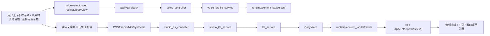
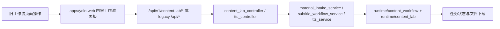
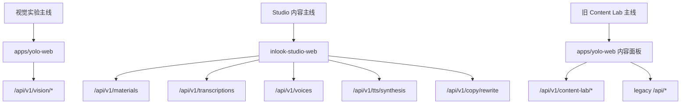

# INLOOK 项目架构图 + 数据流图 + 目录职责说明

更新时间：2026-06-16

## 1. 项目定位

这个仓库已经不是单一的 YOLO Demo，而是一个围绕“识别 + 素材处理 + 文案转写 + TTS + 内容生产”的本地优先智能体工作台。

当前可以把它理解成 3 层：

- 展示层：两个 Vue 前端，分别承担视觉实验台和 Studio 内容工作台
- 服务层：一个 FastAPI 后端，统一暴露视觉、素材、转写、TTS、AI 改写等能力
- 运行时层：以本地目录和 JSON 文件为核心的任务与资产存储

---

## 2. 项目架构图

### 2.1 分层说明

- `apps/yolo-web`
  - 面向“视觉识别实验”和部分旧内容工作流能力
  - 同时覆盖图片识别、视频识别、摄像头识别、素材导入、字幕、TTS
- `inlook-studio-web`
  - 面向“内容生产工作台”
  - 当前更接近主产品形态
- `apps/yolo-api`
  - 统一后端入口
  - 通过 `controllers -> services -> clients/providers/tasks` 组织能力
- `runtime/*`
  - 保存任务状态、产物文件、缓存、浏览器授权目录、音色资产
  - 当前是系统最重要的本地状态层

---

## 3. 后端模块结构图

```mermaid
flowchart TD
  MAIN["app/main.py"]
  MAIN --> HEALTH["health_controller"]
  MAIN --> VISION["vision_controller"]
  MAIN --> MATERIAL["material_controller"]
  MAIN --> TRANS["transcription_controller"]
  MAIN --> AI["ai_controller"]
  MAIN --> VOICE["voice_controller"]
  MAIN --> STTTS["studio_tts_controller"]
  MAIN --> CLAB["content_lab_controller"]
  MAIN --> BAUTH["browser_auth_controller"]
  MAIN --> TASK["task_controller"]
  MAIN --> FILE["file_controller"]
  MAIN --> DH["digital_human_controller"]

  VISION --> VS["vision_service"]
  MATERIAL --> MS["material_service"]
  TRANS --> TS["transcriptions_service"]
  AI --> CRS["copy_rewrite_service"]
  VOICE --> VPS["voice_profile_service"]
  STTTS --> STS["studio_tts_service"]
  CLAB --> MIS["material_intake_service"]
  CLAB --> SWS["subtitle_workflow_service"]
  BAUTH --> BAS["browser_auth_service"]
  TASK --> TLIST["studio_task_service"]
  DH --> DHS["digital_human_service"]

  VS --> YCLI["yolo_client"]
  MS --> MDL["material_download_service"]
  MS --> BCLI["browser_client"]
  TS --> FCLI["ffmpeg_client"]
  TS --> OCRS["ocr_subtitle_service"]
  STS --> TTSS["tts_service"]
  CRS --> LLMCLI["llm_client"]
```

### 3.1 当前后端的真实特征

- 单一 FastAPI 入口，集中装配，入口文件是 [apps/yolo-api/app/main.py](/Users/shen/workspace/src/github.com/inlook-web3/inlook-yolo-model-lab/apps/yolo-api/app/main.py)
- 新旧接口并存
  - 新主线：`/api/v1/...`
  - 兼容旧链路：`/api/...`
- 服务层职责比较清晰，但运行时目录命名有多套历史概念并存

---

## 4. 核心数据流图

## 4.1 视觉识别数据流

输出：

- `apps/yolo-api/uploads/<job_id>/input.*`
- `apps/yolo-api/outputs/<job_id>/result.jpg|result.mp4`
- `apps/yolo-api/reports/<job_id>.json`

---

## 4.2 Studio 素材导入与文案提取数据流

输出：

- 素材输入：`runtime/content_lab/materials/<material_id>/inputs/source.mp4`
- 素材元信息：`runtime/content_lab/materials/<material_id>/material.json`
- 素材输出：`runtime/content_lab/materials/<material_id>/outputs/*`
- 转写任务：`runtime/studio_alpha/transcriptions/tasks/<task_id>/*`

---

## 4.3 AI 改写数据流

特征：

- 当前改写结果主要是“接口返回 + 前端内存态”
- 默认不落盘到 runtime 目录
- 页面刷新后可能丢失上下文

---

## 4.4 音色与 TTS 数据流

输出：

- 音色库：`runtime/content_lab/voices/`
- TTS 任务：`runtime/content_lab/tts/tasks/<task_id>/`
- 最终音频：`runtime/content_lab/tts/tasks/<task_id>/outputs/voice.wav`

---

## 4.5 旧 Content Lab 工作流数据流

说明：

- 这是仓库里仍然有效的旧链路
- 与 `inlook-studio-web` 主链路存在部分能力重叠

---

## 5. 目录职责说明

## 5.1 仓库根目录

| 目录 | 作用 | 当前判断 |
|---|---|---|
| `apps/` | 应用主目录，包含后端和旧前端 | 核心 |
| `inlook-studio-web/` | 新的 Studio 前端 | 核心 |
| `docs/` | 设计、审计、运行文档 | 核心 |
| `deploy/` | 部署相关材料 | 辅助 |
| `scripts/` | 脚本工具 | 辅助 |
| `.caches/` `.uv-cache/` | 本地缓存 | 环境性目录 |

## 5.2 `apps/yolo-api/`

| 目录 | 作用 | 备注 |
|---|---|---|
| `app/` | 后端业务代码主目录 | 核心代码区 |
| `app/controllers/` | API 路由层 | 对外暴露接口 |
| `app/services/` | 核心业务逻辑 | 主逻辑集中区 |
| `app/clients/` | 外部能力封装 | YOLO、FFmpeg、LLM、浏览器等 |
| `app/providers/` | 素材来源 Provider 抽象 | 偏旧工作流 |
| `app/tasks/` | 任务聚合与任务存储辅助 | 和 runtime 强耦合 |
| `app/config/` | 路径、环境、跨域等配置 | 启动关键 |
| `models/` | YOLO 模型文件目录 | 本地模型资产 |
| `uploads/` | 识别任务原始上传文件 | 视觉链路输入 |
| `outputs/` | 识别结果文件 | 视觉链路输出 |
| `reports/` | 识别报告 JSON | 视觉链路输出 |
| `runtime/` | 内容工作流运行时数据根目录 | 当前本地状态核心 |
| `tests/` | 后端测试 | 目前存在，但未做本轮深查 |
| `engines/` | 实验性或第三方引擎适配 | 含 latentsync 模板相关 |

## 5.3 `apps/yolo-api/runtime/`

| 目录 | 作用 | 当前判断 |
|---|---|---|
| `content_lab/` | 当前正式内容链路的主要 runtime 根目录 | 核心 |
| `content_lab/materials/` | Studio 素材资产与派生结果 | 核心 |
| `content_lab/tts/tasks/` | TTS 合成任务 | 核心 |
| `content_lab/voices/` | 音色库存储 | 核心 |
| `content_lab/index/` | 索引文件，如 voice index | 核心辅助 |
| `content_workflow/` | 旧内容工作流 runtime | 遗留但仍在用 |
| `studio_alpha/` | 新 Studio 任务 runtime，如转写、训练 | 核心 |
| `browser_profiles/` | Playwright 持久化登录目录 | 核心辅助 |
| `avatar_poc/` | 数字人/Avatar 实验目录 | POC |
| `template_bank/` | 模板片段、候选结果、报告 | 专项流程 |

## 5.4 前端目录

### `apps/yolo-web/`

| 目录 | 作用 |
|---|---|
| `src/App.vue` | 旧工作台主页面，逻辑集中 |
| `src/api/` | 视觉与旧工作流 API 封装 |
| `src/components/` | 图片识别、素材导入、字幕、TTS 等面板组件 |

### `inlook-studio-web/`

| 目录 | 作用 |
|---|---|
| `src/App.vue` | Studio 主页面，承担绝大多数业务编排 |
| `src/api/` | Studio API 封装 |
| `src/components/` | 素材、改写、音色、预览、导出等界面组件 |
| `src/data/` | 一些前端配置和 mock 数据 |
| `src/styles/` | Studio 样式文件 |

---

## 6. 当前主链路与遗留链路的关系

结论：

- `apps/yolo-web` 不是纯废弃状态，仍然承担视觉实验主入口
- `inlook-studio-web` 是内容生产主线前端
- 后端同时服务两套前端和两套时代的 API 语义

---

## 7. 建议的阅读顺序

如果是新同学接手，建议按下面顺序读代码：

1. [README.md](/Users/shen/workspace/src/github.com/inlook-web3/inlook-yolo-model-lab/README.md)
2. [apps/yolo-api/app/main.py](/Users/shen/workspace/src/github.com/inlook-web3/inlook-yolo-model-lab/apps/yolo-api/app/main.py)
3. [inlook-studio-web/src/App.vue](/Users/shen/workspace/src/github.com/inlook-web3/inlook-yolo-model-lab/inlook-studio-web/src/App.vue)
4. [apps/yolo-web/src/App.vue](/Users/shen/workspace/src/github.com/inlook-web3/inlook-yolo-model-lab/apps/yolo-web/src/App.vue)
5. `material_service / transcriptions_service / voice_profile_service / studio_tts_service / vision_service`
6. `runtime/` 目录下真实任务输出结构

---

## 8. 一句话总结

这是一个“单仓双前端、单后端、多工作流并存、以本地文件 runtime 为核心状态层”的智能体项目。

如果只看今天的主线：

- 视觉识别主线：`apps/yolo-web + /api/v1/vision/*`
- 内容生产主线：`inlook-studio-web + materials/transcriptions/voices/tts/ai`
- 本地状态核心：`apps/yolo-api/runtime/*`
